# Traffic Light Controller – PCB Design Project

## Project Overview
This project demonstrates the design and development of a **proof-of-concept traffic signal controller** using a custom-designed PCB.  
The hardware integrates an **ATmega328P microcontroller**, **RGB LEDs** for traffic light indication, and **dual 7-segment displays with driver circuitry** for countdown functionality.  
The PCB was designed using **Autodesk Eagle**, with schematic creation, component footprint integration, PCB layout, and Gerber file generation carried out as part of the workflow.  

---

## Technical Description
The traffic light controller was designed to simulate real-world traffic management systems with countdown functionality. The project involved:  

- **Microcontroller Integration:** ATmega328P served as the core MCU for control logic and timing.  
- **Traffic Indication:** RGB LEDs were configured as red, yellow, and green traffic lights.  
- **Countdown Display:** Two 7-segment displays, driven by IC CD4511BE, were used to show a two-digit countdown timer.  
- **Power Supply Design:** Onboard regulation using L7805 (TO-252 and D2PAK variants) provided a stable 5V supply from a DC jack or screw terminal input.  
- **Passive Components:** 0603 package resistors and capacitors were used for compact and reliable circuit implementation.  
- **Switching Mechanism:** A tactile pushbutton switch was included for reset/control functionality.  

The entire workflow included schematic capture, PCB layout routing, ERC/DRC validation, and generation of Gerber files for fabrication.  

---

## Key Contributions
- Designed the complete **schematic diagram** and created custom PCB footprints for unavailable components.  
- Optimized PCB layout for minimal routing complexity and reliable signal integrity.  
- Generated **Gerber files, BOM, and assembly drawings** for PCB manufacturing.  
- Conducted **simulation and hardware testing** to validate real-world traffic light sequencing.  
- Implemented **microcontroller programming** to manage timing, LED sequencing, and countdown display.  

---

## Features
- Fully functional **POC traffic light controller**.  
- Modular design enabling easy scaling for more lanes or advanced logic.  
- Compact PCB layout with industry-standard 0603 SMD components.  
- Reliable **5V regulated power supply** designed for low-noise operation.  
- Cost-effective solution with minimal component count and optimized PCB area.  

---
## Eagle Libraries Used
Custom and third-party Eagle libraries were used to support the required components:

- [**PC_CON_DC_Power_Jack.lbr**](PC_CON_DC_Power_Jack.lbr) – DC power input connector  
- [**PC_CON_ScrewTerminal_2P_5mm.lbr**](PC_CON_ScrewTerminal_2P_5mm.lbr) – Screw terminal (2-pin, 5mm pitch)  
- [**PC_Capacitor_0603.lbr**](PC_Capacitor_0603.lbr) – SMD capacitors (0603 package)  
- [**PC_IC_ATMEGA328-AU.lbr**](PC_IC_ATMEGA328-AU.lbr) – ATmega328 (TQFP package)  
- [**PC_IC_ATMEGA328P-AU.lbr**](PC_IC_ATMEGA328P-AU.lbr) – ATmega328P (TQFP package)  
- [**PC_IC_CD4511BE.lbr**](PC_IC_CD4511BE.lbr) – 7-segment display driver IC  
- [**PC_IC_L7805ABD2T-TR.lbr**](PC_IC_L7805ABD2T-TR.lbr) – 7805 voltage regulator (D2PAK package)  
- [**PC_IC_L7805_TO252.lbr**](PC_IC_L7805_TO252.lbr) – 7805 voltage regulator (TO-252 package)  
- [**PC_LED-7-SegmentDisplay.lbr**](PC_LED-7-SegmentDisplay.lbr) – 7-segment LED display  
- [**PC_Resistor_0603.lbr**](PC_Resistor_0603.lbr) – SMD resistors (0603 package)  
- [**PC_Switch_1437566-3.lbr**](PC_Switch_1437566-3.lbr) – Pushbutton switch  
# Traffic Light Controller PCB Design

Developed a traffic signal controller using Atmega328P microcontroller, RGB LEDs, and a seven-segment countdown timer.

---

## Hardware Block Diagram

---

## Hardware Layout with Sections

---

### Schematic Layout  
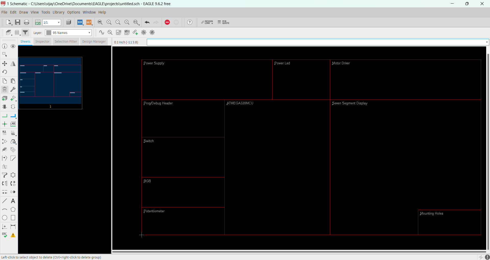  

---

## Power Supply Circuit
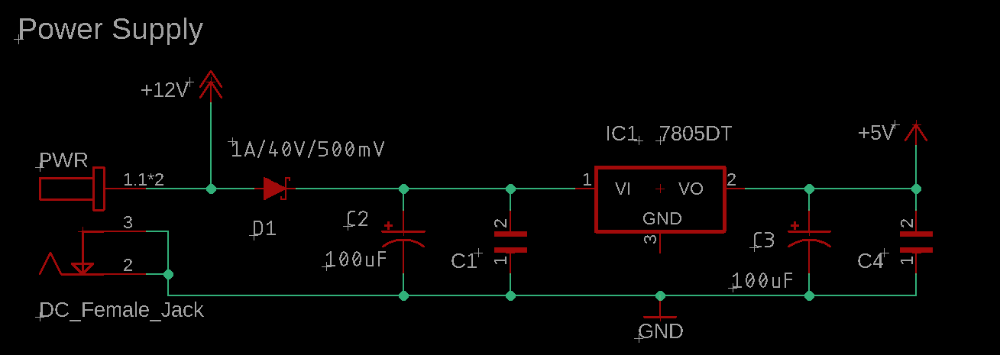

---

## Power LED Circuit
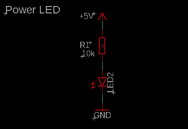

---

## Motor Drive Circuit
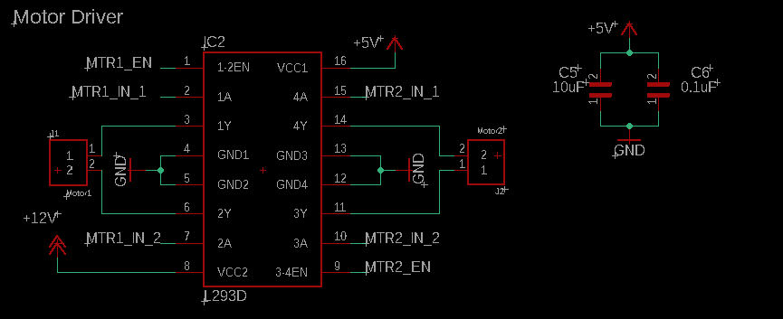

---

## Seven Segment Display Circuit
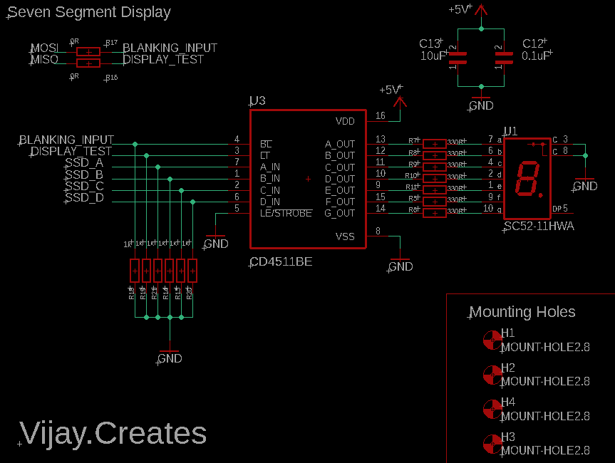

---

## ATmega328 MCU Circuit
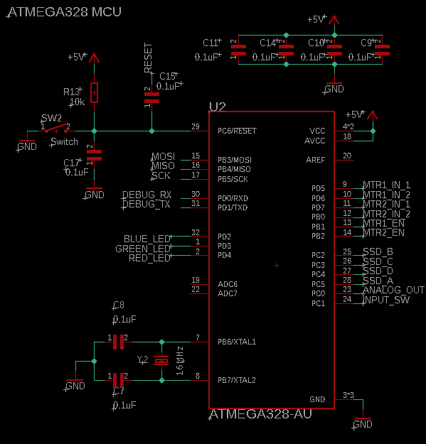

---

## Programming & Debug Circuit
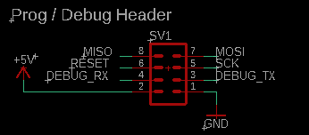

---

## RGB LED Circuit
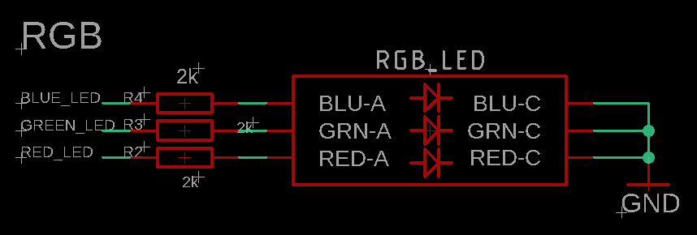

---

## Switch Circuit
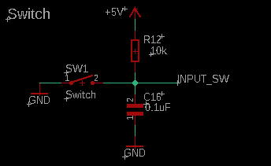

---

## Potentiometer Circuit
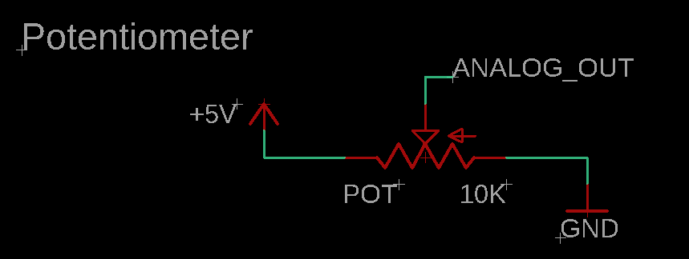

---

## Final Schematic Circuit
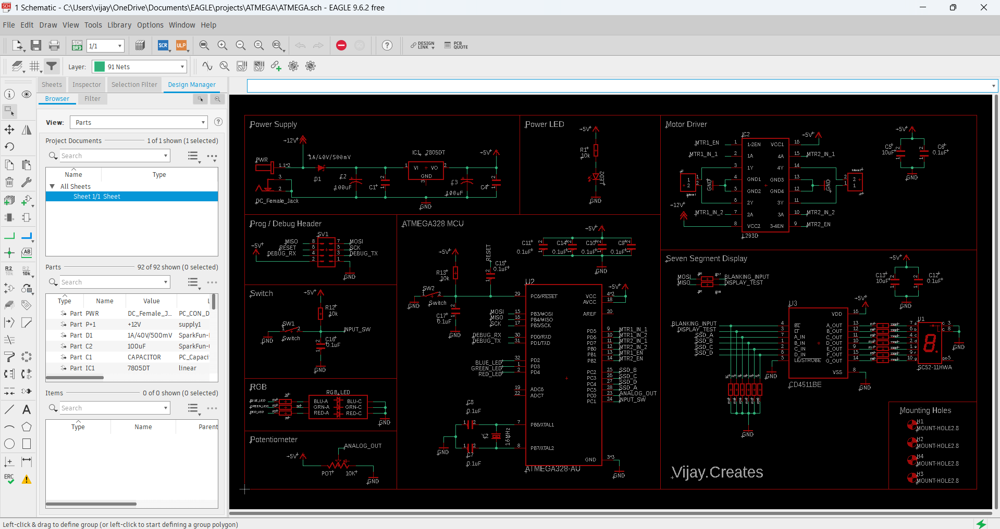

---

## Board Layout
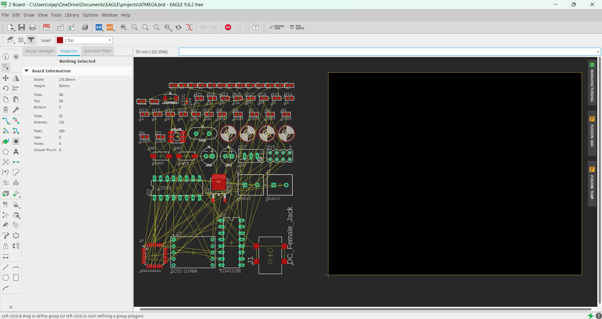

---

## Board DXF View
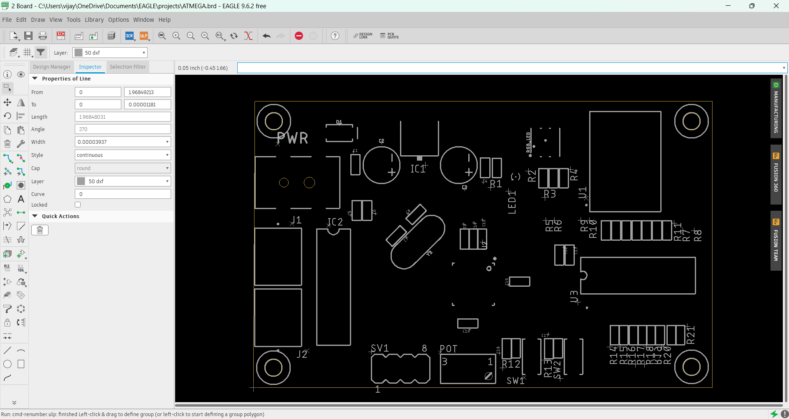

---

## Final Board Design
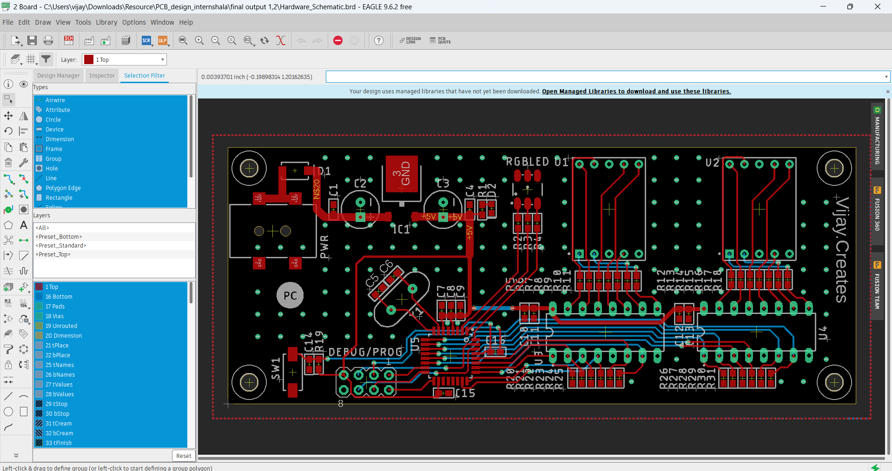

---
## Top Side of Board
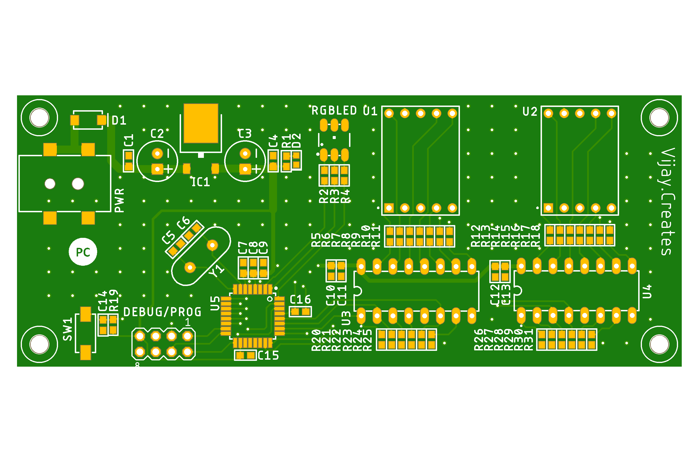

---

## Bottom Side of Board
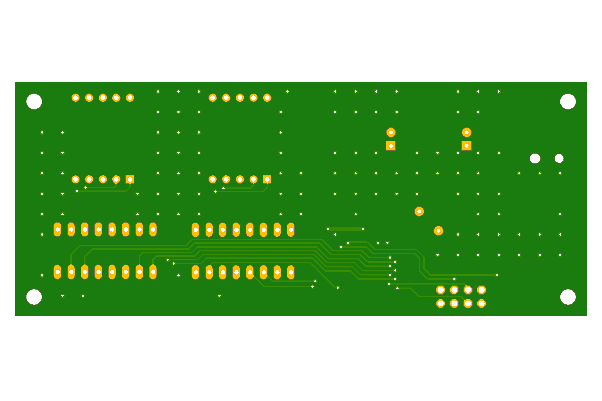

---

## Deliverables
- **Schematic file (.sch)**  
- **Board layout file (.brd)**  
- **Gerber files** for fabrication  
- **Bill of Materials (BOM)**  
- **Assembly drawing** for reference  

---

# 🛠️ PCB Component List

This repository contains the Bill of Materials (BOM) for the PCB design. Below is the categorized list of components with their values, packages, and designators.

---

## 🔌 Capacitors
| Quantity | Value  | Designators                                   | Package                      |
|----------|--------|-----------------------------------------------|------------------------------|
| 10       | 0.1µF  | C1, C4, C6, C9, C10, C12, C14, C15, C16, C17 | 0603                         |
| 2        | 10µF   | C5, C13                                      | 0603                         |
| 2        | 22pF   | C7, C8                                       | 0603                         |
| 1        | 22µF   | C11                                          | 0603                         |
| 2        | 100µF  | C2, C3                                       | CPOL-RADIAL-2.5MM-6.5MM      |

---

## 🎛️ Resistors
| Quantity | Value | Designators                       | Package |
|----------|-------|-----------------------------------|---------|
| 2        | 0Ω    | R15, R17                         | 0603    |
| 6        | 1kΩ   | R12, R13, R14, R16, R18, R19     | 0603    |
| 4        | 2kΩ   | R1, R2, R3, R4                   | 0603    |
| 2        | 10kΩ  | R20, R21                         | 0603    |
| 7        | 330Ω  | R5, R6, R7, R8, R9, R10, R11     | 0603    |

---

## 🖥️ Integrated Circuits (ICs) & Semiconductors
| Quantity | Component                  | Designator | Package   |
|----------|-----------------------------|------------|-----------|
| 1        | ATmega328-AU Microcontroller | U3         | TQFP-32   |
| 1        | CD4511BE BCD-to-7-Segment Decoder | U2 | PDIP-16   |
| 1        | L293D Push-Pull Driver      | IC2        | DIL16     |
| 1        | 7806DT Voltage Regulator    | IC1        | TO-252    |
| 1        | SS14 Schottky Diode         | D1         | SMA-DIODE |

---

## 🔌 Connectors & Sockets
| Quantity | Component             | Designator  | Package                        |
|----------|------------------------|-------------|--------------------------------|
| 1        | DC Power Jack          | PWR         | GCT DCJ200-05-A-XX-X_REVA      |
| 1        | Pin Header (Debug/Prog)| DEBUG/PROG  | MA04-2                         |
| 2        | Terminal Block         | CON1, CON2  | 282836-2                       |

---

## 🛠️ Other Components
| Quantity | Component          | Designator         | Package              |
|----------|--------------------|--------------------|----------------------|
| 1        | RGB LED            | RGBLED             | LED-TRICOLOR-5050    |
| 1        | White LED          | D2                 | LEDC1608X65N         |
| 1        | 16MHz Crystal      | Y1                 | HC49US               |
| 2        | Tactile Switch     | SW1, SW2           | 1437566-3            |
| 1        | 7-Segment Display  | U1                 | SC52-11HWA           |
| 1        | Potentiometer      | POT                | TRIM_US-S64W (S64W)  |
| 4        | Mounting Holes     | H1, H2, H3, H4     | MOUNT-HOLE2.8        |

---

## Conclusion
This project successfully demonstrates the use of **PCB design techniques, embedded system integration, and hardware testing** to create a functional traffic signal controller.  
The outcome highlights the ability to merge **microcontroller programming with practical PCB implementation**, resulting in a **reliable, scalable, and cost-effective hardware prototype** for traffic management applications.  
